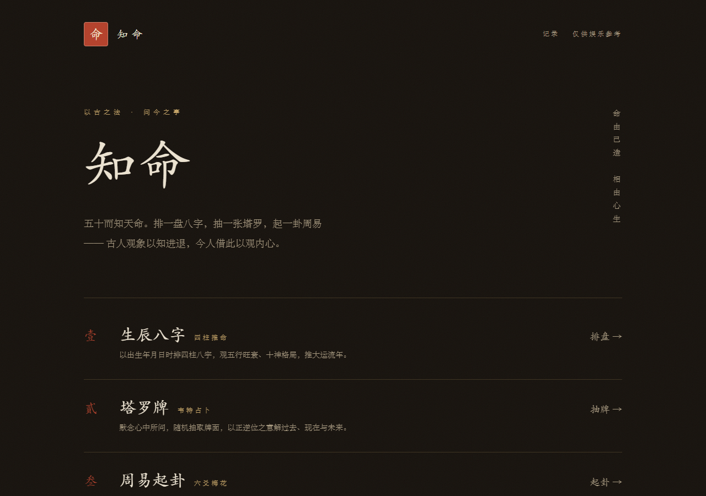
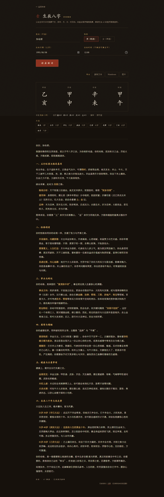

# 知命 · AI 算命

[](LICENSE)

以古之法，问今之事。五大占卜模块，由 AI 流式解读。

*ZhiMing — an AI-powered Chinese divination web app: BaZi (Four Pillars), Tarot, I Ching, daily fortune, and love compatibility. Deterministic computations done in code, LLM only interprets.*



- **壹 · 生辰八字** —— `lunar-javascript` 精确排四柱、五行、十神、大运，LLM 按盘解读
- **贰 · 塔罗牌** —— 78 张韦特牌义数据，服务端随机抽牌定正逆位
- **叁 · 周易起卦** —— 六爻摇卦 / 梅花易数报数起卦，本卦、动爻、变卦、互卦，引卦爻辞解卦
- **肆 · 每日运势** —— 星座 / 生肖当日指数与宜忌
- **伍 · 姻缘匹配** —— 两人八字合盘：五行互补、生肖配对、十神互动与姻缘指数

周边能力：

- **测算记录** —— 每次解读完成自动存档（localStorage，仅本机浏览器，上限 50 条），`/history` 查看、展开、删除、清空
- **导出** —— 结果页可复制文本、下载 Markdown、导出 PNG 图片（命盘/牌面/卦象一并入图）

核心原则：**排盘、抽牌、起卦等确定性计算全部由代码完成，LLM 只负责解读**，杜绝模型幻觉出错的事实。

## 快速开始

```bash
npm install
cp .env.example .env.local   # 填入你的 DEEPSEEK_API_KEY
npm run dev                  # http://localhost:3000
```

`.env.local` 配置项：

| 变量 | 说明 | 默认 |
| --- | --- | --- |
| `DEEPSEEK_API_KEY` | API Key（必填） | — |
| `LLM_BASE_URL` | OpenAI 兼容接口地址 | `https://api.deepseek.com` |
| `LLM_MODEL` | 模型名 | `deepseek-v4-pro`（如报模型不存在，改为 `deepseek-chat` 等） |

任何 OpenAI 兼容服务（DeepSeek、Kimi、本地 vLLM 等）都可通过这三个变量接入。



## 测试

```bash
npm test                     # vitest：排盘/抽牌/起卦/prompt 共 26 个用例
npm run build                # 类型检查 + 生产构建
```

无真实 Key 的端到端冒烟：先 `node scripts/mock-llm.cjs`（OpenAI 兼容桩服务，4010 端口），再以
`DEEPSEEK_API_KEY=test LLM_BASE_URL=http://127.0.0.1:4010 npm run start` 启动，即可走通全部流式链路。

## 结构

```
app/                    页面（首页 + 五模块 + history 记录页）与 api/divine 统一流式接口
lib/divine/             占卜引擎：types(zod 校验) bazi tarot iching fortune match common(系统 prompt) facts(facts 类型与摘要)
lib/records.ts          测算记录（localStorage + useSyncExternalStore）
data/                   静态数据：78 张塔罗牌、64 卦卦爻辞
components/             表单、结果可视化（排盘/牌面/卦象/双人合盘）、流式渲染、导出工具栏
tests/                  vitest 单测
scripts/mock-llm.cjs    本地桩 LLM（冒烟测试用）
```

接口约定：`POST /api/divine { type, payload }` → `application/x-ndjson`，首行为结构化结果 JSON（facts），其后为 LLM 解读文本流。

## License

[MIT](LICENSE)

仅供娱乐参考。
